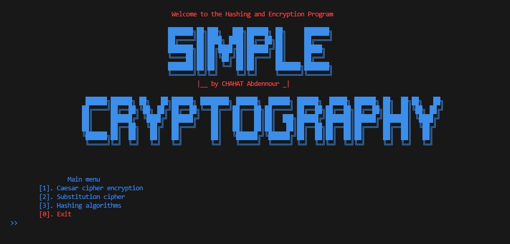

# Cybersecurity Projects

Welcome to the cybersecurity projects repository, featuring over 20 projects designed to enhance your skills in this critical field, suitable for beginners to advanced learners.

Explore my LinkedIn profile for more information: [Visit LinkedIn](https://www.linkedin.com/in/chahat-abdennour)

---

## Project 1: Simple Cryptography

- **Comprehensive Encryption Tool**: This script provides a user-friendly interface for encrypting, decrypting, and hashing text using various algorithms.
- **Multiple Ciphers**: Includes implementations of Caesar cipher and substitution cipher for practical learning.
- **Hashing Functions**: Utilizes MD5, SHA-256, SHA-3, and more algorithms for data integrity verification.
- **Intuitive Interface**: Navigate through menus to perform operations, generate keys, and select hashing algorithms.
- **Enhanced User Experience**: Features visually appealing ASCII art banners, color-coded text output, and terminal clearing for a polished interface.

---

# Projects Currently in Publication

Stay tuned for updates on upcoming projects.

---
