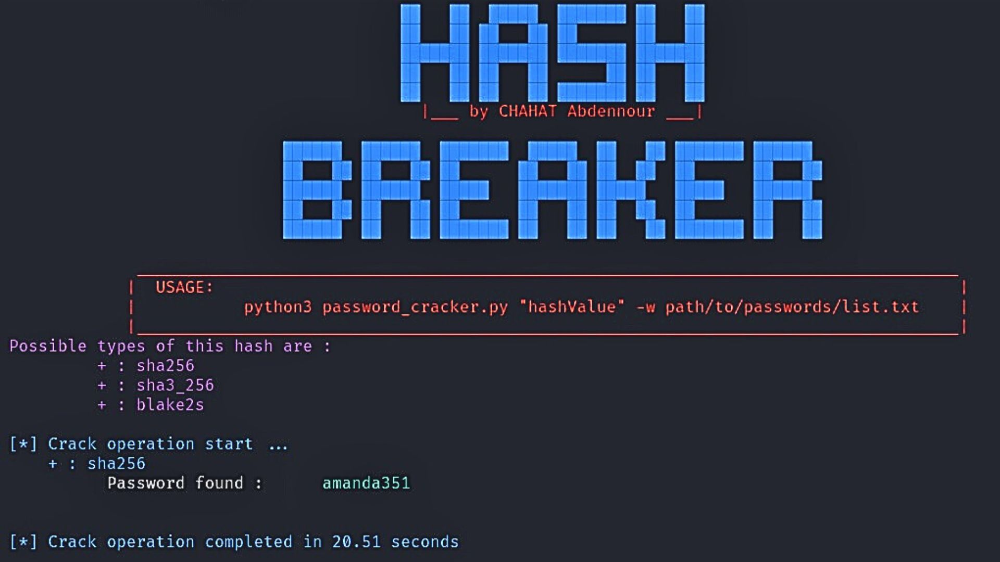

# Cybersecurity Projects

Welcome to the cybersecurity projects repository, featuring over 20 projects designed to enhance your skills in this critical field, suitable for beginners to advanced learners.

Explore my LinkedIn profile for more information: [Visit LinkedIn](https://www.linkedin.com/in/chahat-abdennour)

---

## Project 1: Simple Cryptography

- **Comprehensive Encryption Tool**: This script provides a user-friendly interface for encrypting, decrypting, and hashing text using various algorithms.
- **Multiple Ciphers**: Includes implementations of Caesar cipher and substitution cipher for practical learning.
- **Hashing Functions**: Utilizes MD5, SHA-256, SHA-3, and more algorithms for data integrity verification.
- **Intuitive Interface**: Navigate through menus to perform operations, generate keys, and select hashing algorithms.
- **Enhanced User Experience**: Features visually appealing ASCII art banners, color-coded text output, and terminal clearing for a polished interface.

---

## Project 2: Hash Breaker

### HashBreaker
HashBreaker is a powerful and efficient script designed to crack hash values using a specified wordlist. This script supports a wide range of hash types and is capable of identifying and cracking them in a user-friendly manner.

- **Multiple Hash Type Support**: Automatically detects and supports various hash types, including MD5, SHA1, SHA224, SHA256, SHA384, SHA512, and more.
- **User-Friendly Output**: Provides colored output for better readability and user experience.
- **Performance Tracking**: Measures and displays the time taken to crack each hash.
- **Cross-Platform Compatibility**: Works on both Windows and Unix-based systems (e.g., Linux, macOS).

---

# Projects Currently in Publication

Stay tuned for updates on upcoming projects.

---
